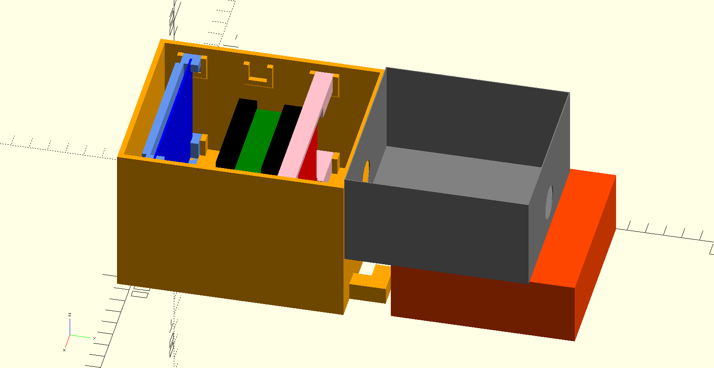

# Light Controller Case

The problem: Aquarium lights controlled by mechanical timers going on and off at unpredictable times because of the mechanical timers getting jostled, causing their programming to be messed up, and because of power outages causing their set time to slip.

The solution: A Banana Pi M64 with a PowerShell script (yes, you can run PowerShell on Linux now!) that implements a robust, configurable timer mechanism that outputs signals over GPIO, a hat for the M64 with multiple relays rated for mains power, and a device box with outlets wired up to it.

[Source Code](https://github.com/logiclrd/lights)