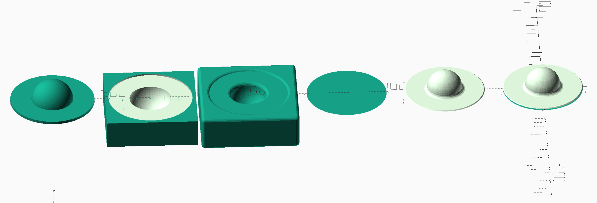
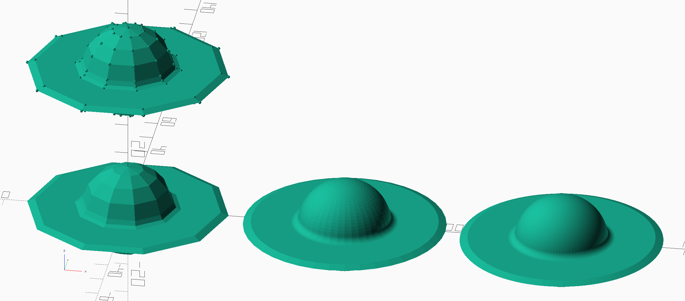

# Saturn Filleting Example

## Approach: Minkowski

The approach here is to use a Minkowski product to round the hard edge between Saturn and the rings. A straightforward Minkowski won't do the trick, because it's the negative image of a rounded boundary that we want to stamp onto the edge. So, we negate the proto-Saturn, and then do a Minkowski of that with a sphere, then negate it again. This screenshot shows the steps:

1: Proto-Saturn. Combines the main sphere of the planet with a simple disc for the rings.

2: Negative of proto-Saturn. Subtracts proto-Saturn from a solid rectangular prism. We do just one half and then flip the result and combine to make it whole again because the Minkowski operator doesn't play well with solids with interior space.

3: The Minkowski product of the shape from step 2 with a small sphere. Note how the boundary between the planet and the rings has been filleted (in the negative) exactly as desired.

4: Subtracting step 3 from a box again turns it back into positive space. In the screenshot, we can't see the bulge of the planet because it is below the disc of the rings. This is the bottom half.

5: The top half is just the bottom half flipped vertically.

6: Splat steps 4 and 5 together into a single shape to make the desired result.

Source code: [saturn.scad](saturn.scad)

## Approach: Direct Geometry

The approach here is to produce points and faces that can be passed to the `polyhedron()` function directly. The points are generated in "bands" (rings of points, but the word "ring" was already taken :-) ). These bands are then joined together using quads (except for the final "band", which is just a single point and is thus covered in triangles). As with the previous approach, the vertical symmetry is leveraged by generating just one half, and then flipping and joining for the other half.

Source code: [saturn2.scad](saturn2.scad)

## Comparison

The Minkowski approach generalizes to more complex shapes easily, but takes a very long time to compute. The direct geometry approach requires a lot of careful thought to make even simple alterations to the geometry, but processes very quickly.

